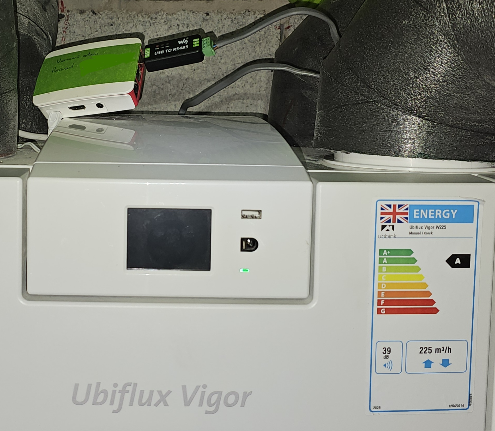
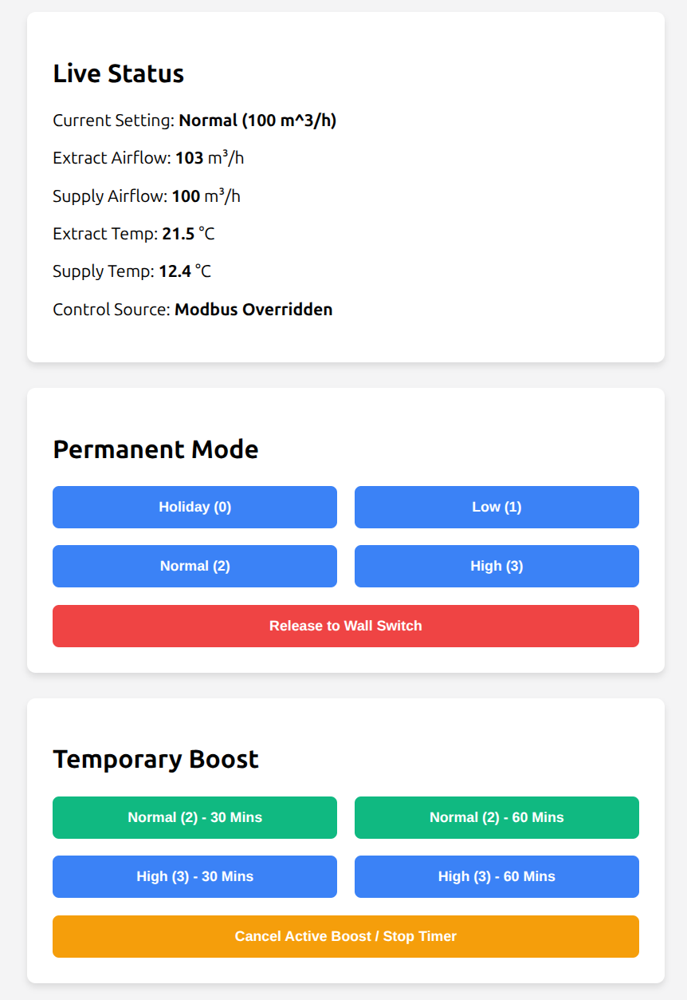

# Ubbink Controller
Code to control your MVHR via a simple website.

Tested on a Ubbink Ubiflux Vigro 225.

Uses Python 3.13.

Tested on Ubuntu and Raspberry Pi OS.


## UI


## Connecting to MVHR
You will need a USB to RS485 dongle. 
I used USB to RS485 Modbus Adapter – Standard from Waveshare.


The modbus plug on the MVHR pulls out and allows you to install the cables.

### USB Device
Check where your usb adaptor shows up and update the `src/config.py` accordingly. 
```bash
ls /dev/ttyUSB*
```

You can check that its working by using mbpoll:
```bash
sudo apt update
sudo apt install mbpoll
```
and then try to read from a registry
```bash
mbpoll -a 20 -b 19200 -P even -m rtu -t 3 -r 4022 -c 1 /dev/ttyUSB0
```

## Install Repo
Clone and create a venv and install dependencies:
```bash
git clone https://github.com/EdgarMCR/UbbinkController.git
cd UbbinkController
python3 -m venv venv
source venv/bin/activate
pip install -e .
```
If the USB device is plugged in and connected to the Ubbink, you can run the webservice
with 
```bash
uvicorn src.app:app --host 0.0.0.0 --port 8000
```
## Run on startup
```bash
sudo nano /etc/systemd/system/ubbink.service
```
and past in the details, taking care to update the paths
```toml
[Unit]
Description=Ubbink Vigor Web Controller
After=network.target

[Service]
# Change these to your actual user and project directory
User=admin
WorkingDirectory=/home/admin/UbbinkController
# Path to your virtual environment's uvicorn
ExecStart=/home/admin/UbbinkController/venv/bin/uvicorn src.app:app --host 0.0.0.0 --port 8000

Restart=always
RestartSec=15
StandardOutput=inherit
StandardError=inherit

[Install]
WantedBy=multi-user.target
```

Reload the systemd daemon
```bash
sudo systemctl daemon-reload
```
Enable the service so it starts on boot
```bash
sudo systemctl enable ubbink.service
```
Start the service now
```bash 
sudo systemctl start ubbink.service
```

### Other useful commands

Check if it's running: `sudo systemctl status ubbink.service`

View live logs (highly useful): `journalctl -u ubbink.service -f`

Stop the service: `sudo systemctl stop ubbink.service`

Restart after a code update: `sudo systemctl restart ubbink.service`

## Issues
### 
Serial Port Permissions
If the service fails to start with a "Permission Denied" error for /dev/ttyUSB0, 
ensure your user belongs to the dialout group:
```bash
sudo usermod -a -G dialout $USER
```